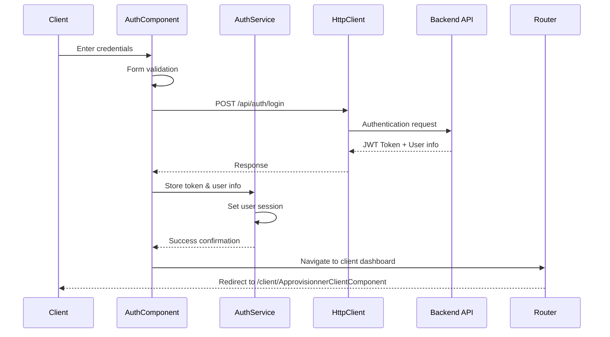
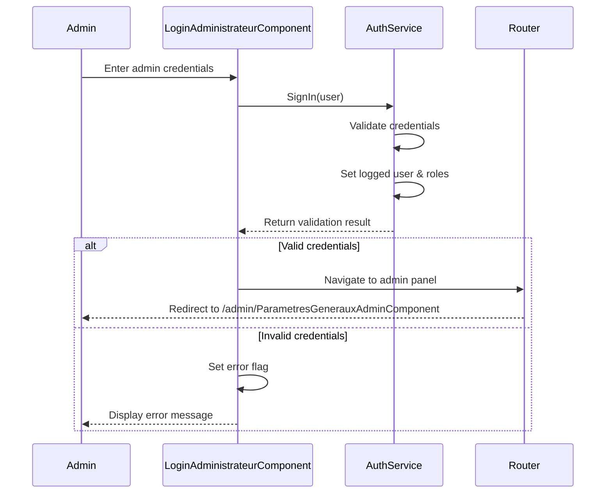
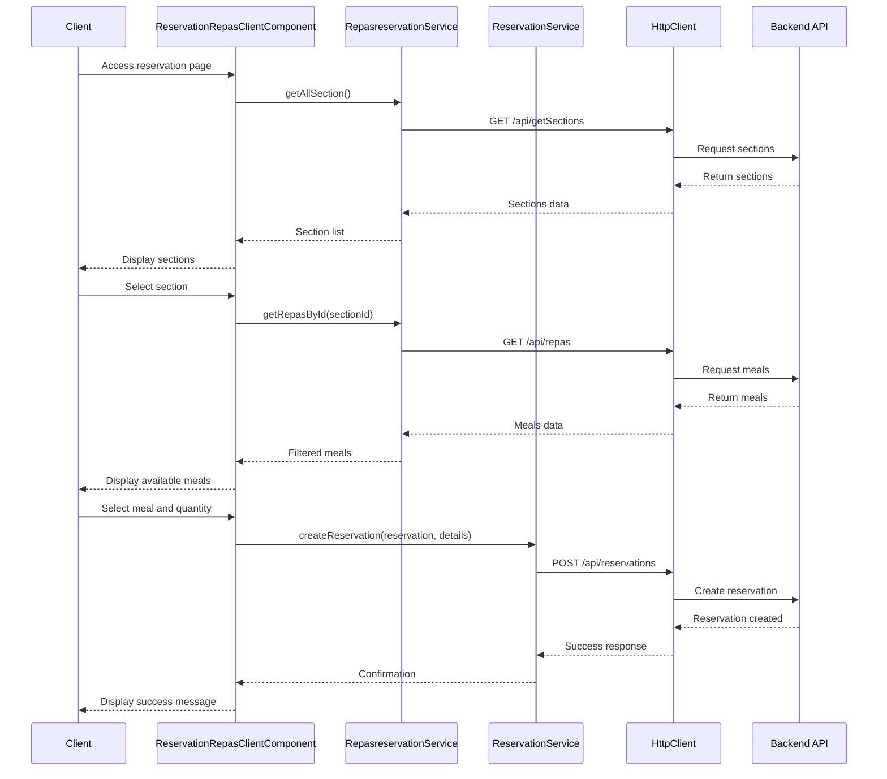
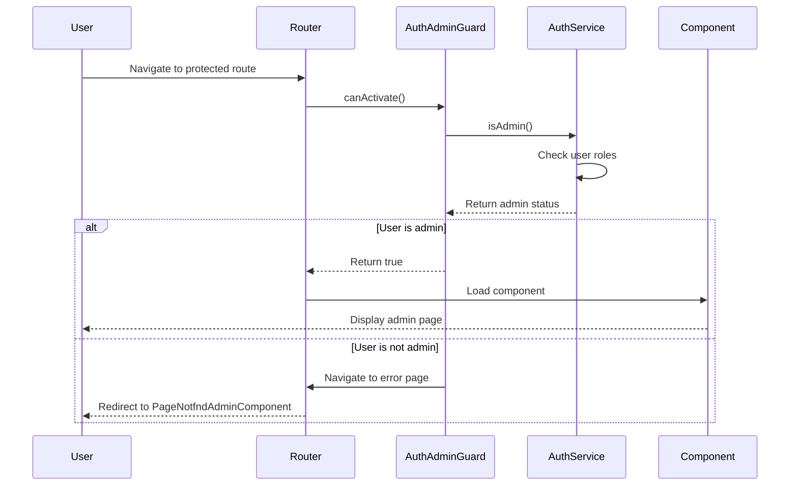
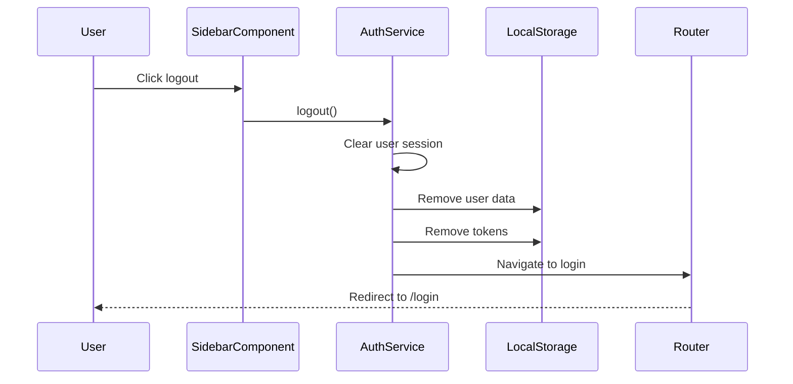
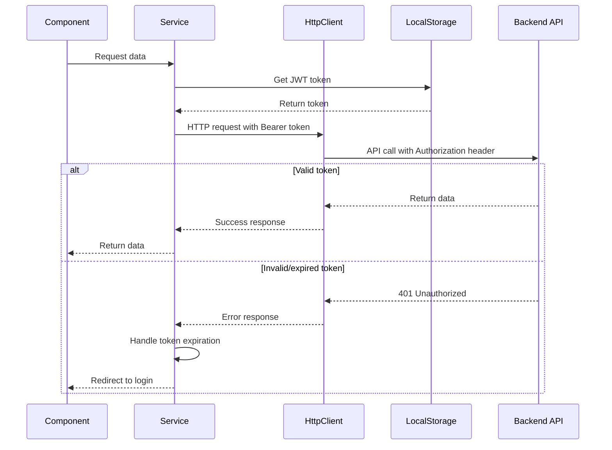
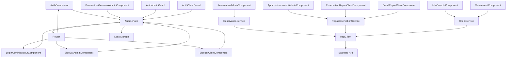

# RestoNet - UML Diagrams

## Class Diagram

```mermaid
classDiagram
    %% Core Models
    class ClientModel {
        +string matricule
        +string motdepasseintranet
        +string[] roles
    }
    
    class Repasreservation {
        +number repasareservation
        +Date daterepas
        +string designation
        +number repasmodele
        +Date datedebutreservation
        +Date datefinreservation
        +string codeservice
        +string section
    }
    
    class Reservation {
        +number numeroReservation
        +number repasReservation
        +string client
        +string nom
        +string societe
        +string unite
        +string categorieClient
        +string modeSaisie
        +string operateur
        +Date dateSaisie
        +string heureSaisie
        +string modeValidation
        +string etatReservation
        +number nombreRepas
        +number numeroPlateau
        +string facture
        +string codeService
    }
    
    class SectionModel {
        +string section
        +string designation
        +string gestionreservations
        +string codeservice
    }
    
    class DetailReservation {
        +number numeroReservation
        +string codeArticle
        +number quantite
    }
    
    class ArticleModel {
        +string article
        +string designation
        +number prix
    }
    
    %% Services
    class AuthService {
        +ClientModel[] users
        +string loggedUser
        +boolean isloggedIn
        +string[] roles
        +Router router
        +SignIn(ClientModel user) boolean
        +isAdmin() boolean
        +isCreate() boolean
        +logout() void
        +setLoggedUserLS(string login) void
        +getRoles(string login) void
    }
    
    class ReservationService {
        -string apiUrl
        -HttpClient http
        +createReservation(Reservation reservation, any[] details) Observable~Reservation~
        +getReservations() Observable~Reservation[]~
        +updateReservation(Reservation reservation) Observable~Reservation~
        +deleteReservation(number id) Observable~void~
    }
    
    class RepasreservationService {
        -string host
        +Repasreservation[] repas
        +SectionModel[] sections
        -HttpClient http
        +getAllSection() Observable~SectionModel[]~
        +getSectionById(string section) Observable~SectionModel~
        +getRepasById(number id) Observable~Repasreservation~
        +getAllRepas() Observable~Repasreservation[]~
    }
    
    class ClientService {
        -string apiUrl
        -HttpClient http
        +getClient(string matricule) Observable~ClientModel~
        +updateClient(ClientModel client) Observable~ClientModel~
        +getClientMovements(string matricule) Observable~any[]~
    }
    
    %% Components
    class AuthComponent {
        +FormControl clientControl
        +FormControl passwordControl
        +TexteAccueilService textService
        +Router router
        +HttpClient http
        +onSubmit() void
        +ngOnInit() void
    }
    
    class LoginAdministrateurComponent {
        +number error
        +ClientModel user
        +AuthService authService
        +Router router
        +onLoggedin() void
        +ngOnInit() void
    }
    
    class ReservationRepasClientComponent {
        +string selectedSection
        +string selectedService
        +Repasreservation[] repas
        +SectionModel[] sections
        +Repasreservation[] filteredRepas
        +RepasreservationService repasreservationService
        +Router router
        +ngOnInit() void
        +filterRepas() void
        +selectRepas(Repasreservation repas) void
    }
    
    class SideBarAdminComponent {
        +AuthService authService
        +Router router
        +ngOnInit() void
        +logout() void
    }
    
    class SidebarClientComponent {
        +AuthService authService
        +Router router
        +ngOnInit() void
        +logout() void
    }
    
    %% Guards
    class AuthAdminGuard {
        +canActivate(route, state) boolean
    }
    
    class AuthClientGuard {
        +canActivate(route, state) boolean
    }
    
    %% Relationships
    ClientModel ||--o{ Reservation : "makes"
    Reservation ||--o{ DetailReservation : "contains"
    Reservation }o--|| Repasreservation : "references"
    SectionModel ||--o{ Repasreservation : "categorizes"
    ArticleModel ||--o{ DetailReservation : "details"
    
    AuthService --> ClientModel : "manages"
    ReservationService --> Reservation : "handles"
    RepasreservationService --> Repasreservation : "manages"
    RepasreservationService --> SectionModel : "retrieves"
    ClientService --> ClientModel : "manages"
    
    AuthComponent --> AuthService : "uses"
    LoginAdministrateurComponent --> AuthService : "uses"
    ReservationRepasClientComponent --> RepasreservationService : "uses"
    SideBarAdminComponent --> AuthService : "uses"
    SidebarClientComponent --> AuthService : "uses"
    
    AuthAdminGuard --> AuthService : "checks"
    AuthClientGuard --> AuthService : "checks"
```

## Sequence Diagrams

### 1. Client Login Process



### 2. Admin Login Process



### 3. Meal Reservation Process



### 4. Route Guard Authentication



### 5. Logout Process



### 6. API Request with JWT Token



## Component Interaction Diagram



---

These diagrams provide a comprehensive view of the RestoNet application's architecture, showing the relationships between classes, the flow of user interactions, and the system's behavior during key operations.
